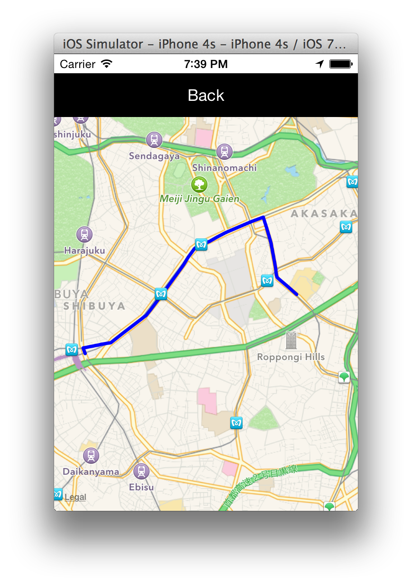

# Titanium Map Module [](https://travis-ci.org/appcelerator-modules/ti.map)

This is the Map Module for Titanium.

## Contributors

* Please see https://github.com/appcelerator-modules/ti.map/graphs/contributors
* Interested in contributing? Read the [contributors/committer's](https://wiki.appcelerator.org/display/community/Home) guide.

## Legal

This module is Copyright (c) 2010-2014 by Appcelerator, Inc. All Rights Reserved. Usage of this module is subject to 
the Terms of Service agreement with Appcelerator, Inc.  

## MKDirections fork



This fork is MKDirections support.
Use only for iOS.

### Sample code

```
var Map = require('ti.map');

var win = Ti.UI.createWindow();

var map = Map.createView({
    userLocation: true,
    mapType: Map.NORMAL_TYPE,
    animate: true,
    region: {latitude: 35.665213, longitude: 139.730011, latitudeDelta: 0.02, longitudeDelta: 0.02 }, //Roppongi
    top: '10%'
});
win.add(map);

var directions = Map.createDirections({
    source: {
        latitude: 35.665213,
        longitude: 139.730011
    },
    destination: {
        latitude: 35.658987,
        longitude: 139.702776
    }
});

directions.addEventListener('success', function(e){
    var route = Map.createRoute({
        points: e.coordinates,
        color: 'blue',
        width: 5.0
    });

    map.addRoute(route);
});
    
directions.addEventListener('error', function(e){
    alert('Error');
});

win.opne();
```

[Reference link](http://qiita.com/koogawa/items/d047a8056a0db5b05771)